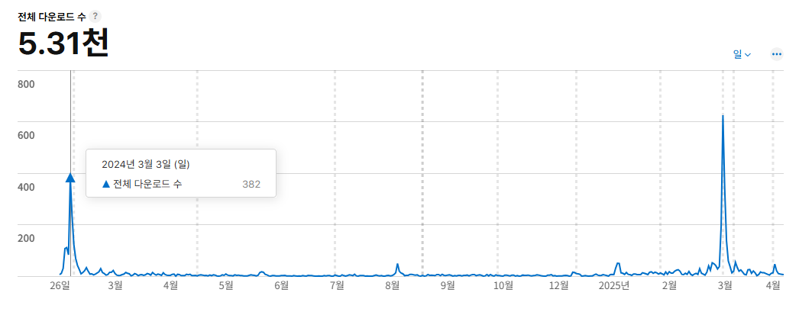
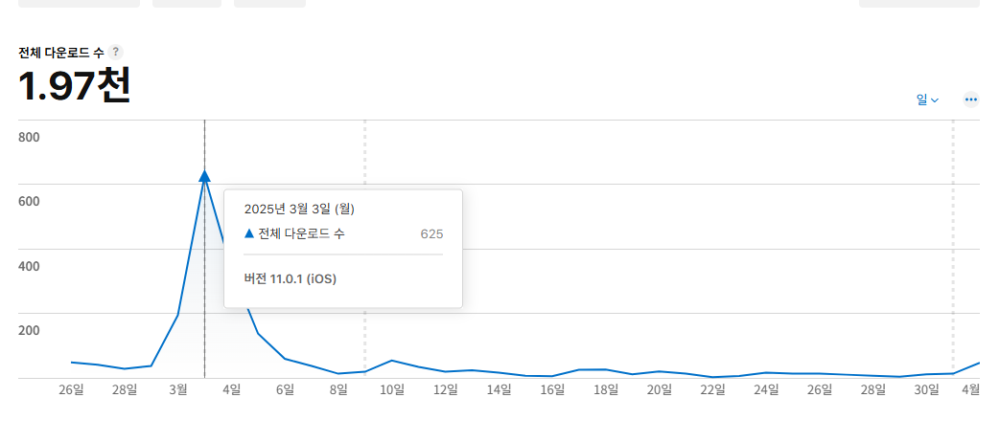

# 마이그레이션 기록

## 1️⃣ 마이그레이션 역할 분담

| 파트       | 팀원                                                                                                 | 주요 기여                                                                                                                                             |
| ---------- | ---------------------------------------------------------------------------------------------------- | ----------------------------------------------------------------------------------------------------------------------------------------------------- |
| 프론트엔드 | 김정욱 (React) 김하진 (React) 김형준 (React) 이태엽 (React Native) 하윤지 (React Native) | - 기존 React Native 코드 유지/보완 - React + WebView 구조 설계 및 적용 - UI/UX 리뉴얼 및 성능 최적화                                            |
| 백엔드     | 이태엽 장채원                                                                                     | - Python 코드 제거 및 Spring Boot 기반 전환 - API 안정화 및 서버 리팩터링  - AWS EC2, S3 서버 구축  - Docker, Jenkins, Nginx 도입 CI/CD 구축 |
| 디자인     | 은경수 정우식                                                                                     | - 전체 디자인 리뉴얼 - 반응형 화면 설계 및 사용자 피드백 반영                                                                                      |

## 2️⃣ 개요

우리 팀은 2025년 3월, **React Native 100% 기반이었던 기존 앱을 전면 마이그레이션**하였습니다.  
그 배경에는 다음과 같은 문제가 있었습니다.

- 인수인계 부족 -> 유지보수/확장성 저하
- 구시대적 기술 탈피 필요성
- 전체적인 디자인 변경 요구

## 3️⃣ 기술적 변화

- **백엔드**: Python -> 제거 (불필요한 레거시 코드 정리)
- **프론트엔드**: React Native 단일 구조 -> `React (Web)` + `React Native (App)` + `WebView` 통합
- **인프라**: 기타 서버 -> **AWS 기반 클라우드 서버** 전환

## 4️⃣ 성과 지표

마이그레이션 전후 **다운로드 수 추이**:

  
  

| 시점       | 다운로드 수 |
| ---------- | ----------- |
| 2024년 3월 | 382         |
| 2025년 3월 | 625         |

마이그레이션 이후 **약 63.6% 증가**하여 사용자 유입 효과가 명확하게 나타났습니다.

## 5️⃣ 추가 효과

- 디자인 리뉴얼 -> **UI/UX 개선 및 사용자 만족도 상승**
- 코드베이스 정리 -> **신규 기능 추가 시 개발 속도 향상**
- AWS 전환 -> **안정적인 서비스 운영 및 확장성 확보**
